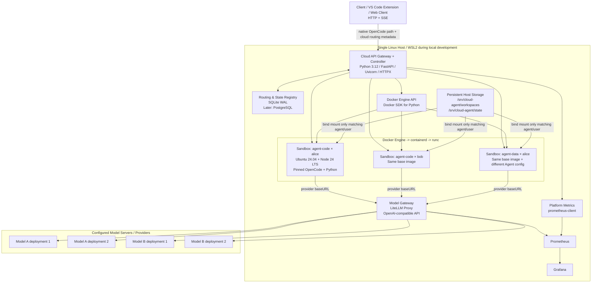
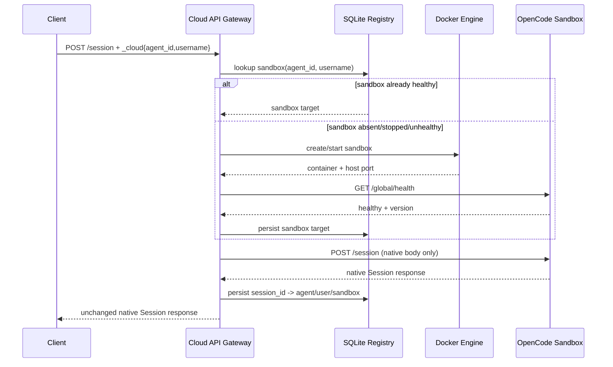
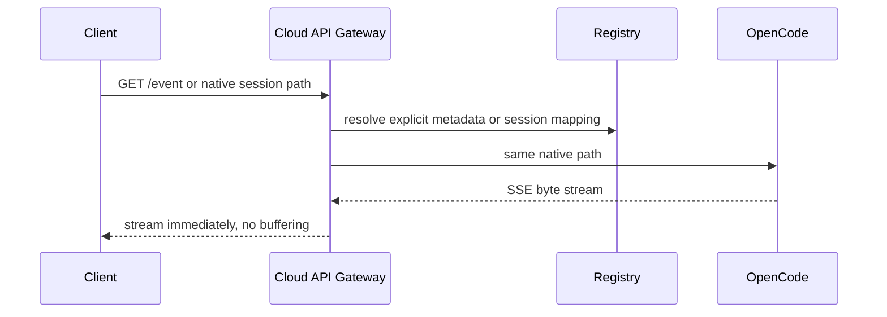
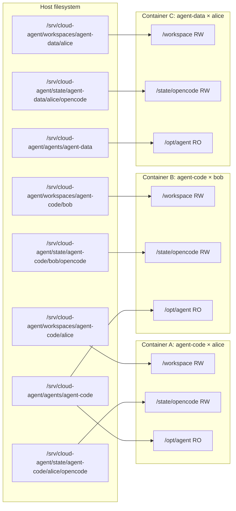
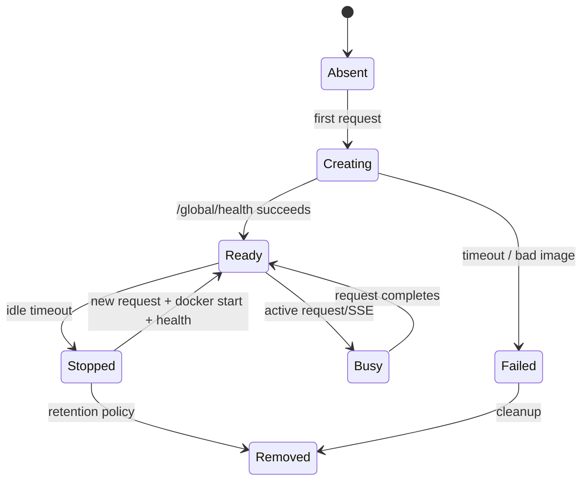

# OpenCode 云端智能体平台 — 架构设计

> 状态：拟议的实现基线  
> 目标：使用 Windows + VS Code + Codex 开发，通过 WSL2 进行本地验证；生产环境优先采用单台 Linux 主机，后续可扩展至多主机  
> 主要语言：Python  
> 运行时决策：Docker Engine + runc  
> 沙箱键：`(agent_id, username)`  
> OpenCode 原则：使用未经源码修改的上游 `opencode serve`，并保留其原生 HTTP 路径

---

## 1. 最终架构决策

### 1.1 Agent 是逻辑定义，而非容器

Agent 是描述以下内容的可复用模板：

- 基础镜像版本；
- OpenCode 版本；
- Agent 级 `opencode.json`；
- 本地钩子/插件；
- 默认技能；
- 默认 MCP 配置；
- 此 Agent 可用的模型别名；
- CPU / 内存 / PID 上限；磁盘由平台级每用户工作区配额管理，不是 `agent.cfg` 的资源字段；
- 空闲超时和沙箱生命周期策略。

容器创建时实际采用 `agent.cfg` 的 `[resources] cpu_limit / memory_mb / pids_limit`；这些是每个容器的上限，并非为容器预留的资源，也不是整台宿主机的并发准入限制。当前 Agent 配置要求显式填写资源字段，平台 `default_*` 是模板参考值，不会覆盖 Agent 配置。容量测试和生产并发建议必须另行考虑宿主机总资源。

为特定的 `(agent_id, username)` 组合创建物理沙箱：

```text
Sandbox Key = agent_id + username
```

因此：

- Alice 使用 `agent-code` 和 `agent-data` 时会获得两个沙箱；
- Alice 在 `agent-code` 中打开多个会话时复用同一沙箱；
- Bob 使用 `agent-code` 时获得的沙箱与 Alice 不同；
- 同一用户的会话通过 OpenCode 会话 ID 和目录在逻辑上分隔，但不作为相互敌对的安全租户处理。

### 1.2 容器是用户安全边界

使用 Docker Engine 作为管理 API，使用 runc 作为默认 OCI 运行时。

两个内置 Agent 按无人值守运行要求设置 OpenCode `permission: "allow"`，所有工具默认授权，包括外部目录访问，避免执行过程中等待人工确认。实际文件访问仍受容器非 root 用户、只读根文件系统、只读 Agent 挂载和用户独立工作目录约束；工具授权不会改变这些 Docker/Linux 隔离边界。

空闲回收采用“停止并删除容器、保留持久化数据”：健康监控按配置周期检查，在 Agent 空闲超时后，确认没有活动请求租约且原生 `/session/status` 没有运行中任务，再停止并删除本实例拥有的容器。默认空闲超时为 1800 秒，检查周期为 30 秒，实际延迟还包含扫描及 Docker 操作时间。删除失败后可在后续扫描重试已停止容器。下一次访问重新创建容器，并复用工作区与 OpenCode 状态；不删除用户文件和历史会话。日志限制为每容器 10 MB × 3 个文件。长期数据保留、全盘容量预警和异常容器回收需独立验收，不能将进程内存释放等同于全部磁盘数据清除。

不要在应用程序代码中直接管理 runc bundle。

固定版本首次项目请求还会为可写配置目录后台安装插件 SDK，禁用默认插件不足以阻止它。受控沙箱将 `XDG_CONFIG_HOME` 指向只读 Agent 挂载中的 `/opt/agent/global`，预建 `global/opencode/.gitignore`，利用上游不可写目录跳过安装的实现。空工作区首次会话接口不再产生每用户 npm 缓存；全局配置运行期不可写。用户主动创建项目或 HOME 的 `.opencode` 目录仍可能触发其依赖安装，必须作为用户工作负载单独计量。定位证据见 `artifacts/perf/runtime-init-analysis.md`。

沙箱启用 Docker `init`，由 Docker 自带 init 转发信号并回收孤儿子进程。参考机器对照实验中，OpenCode 直接运行于 PID 1 时停止约 11.04 秒、退出码 137；启用 init 后约 0.91 秒、退出码 143，均未发生 OOM。健康扫描使用最多 4 个 worker，避免多个容器停止等待串行累积；同一个 Agent×User 的锁、活动请求保护和原生忙闲检查仍然生效。正常扫描周期与空闲超时不变，批量回收时间以实测报告为准。

首个版本不实现自定义的逐会话挂载命名空间工作进程。

安全边界是：

```text
Alice + agent-code container  !=  Bob + agent-code container
```

容器绝不能挂载其他用户的工作区。

### 1.3 同一用户的会话共享一个 OpenCode 服务器

在一个 `(agent_id, username)` 沙箱内：

```text
one container
  -> one opencode serve
      -> session A
      -> session B
      -> session C
```

同一用户的会话可以访问相同的用户工作区。会话文件夹主要是组织边界，而不是敌对隔离边界。

### 1.4 保持 OpenCode 不被修改

初始平台不要派生 OpenCode。

平台必须：

- 运行经过固定和测试的上游 OpenCode 版本；
- 暴露 OpenCode 的原生路径，例如 `/session`、`/session/:id/message`、`/event`、`/global/health`、`/file`、`/mcp` 等；
- 仅在云端网关添加路由元数据；
- 转发给 OpenCode 前移除云端专用路由元数据；
- 保留原生响应正文和 SSE 事件载荷。

### 1.5 分离两类网关职责

使用两个逻辑上独立的网关：

1. **云端 API 网关 / 沙箱路由器** — Python FastAPI + HTTPX。
   - 接收兼容 OpenCode 的客户端请求。
   - 解析 `(agent_id, username)`。
   - 获取/复用正确的沙箱。
   - 代理原始 OpenCode 路径。
   - 无缓冲地传输 SSE 流。
   - 负责文件上传/下载云端扩展。

2. **模型网关** — 初期使用 LiteLLM Proxy。
   - 向 OpenCode 提供兼容 OpenAI 的模型端点。
   - 在逻辑模型名称之后承载多个物理部署。
   - 执行负载均衡、重试、冷却和回退。
   - 暴露 Prometheus 指标，包括流式请求的 TTFT。

这样可使沙箱路由和模型路由相互独立。

### 1.6 网络策略

首个版本中**不要**添加用户级出站目标白名单。

假设：能够访问所配置服务器的用户均为可信用户。

仍需保留基本的容器安全边界：

- 不使用 `--privileged`；
- Agent 沙箱内不提供 Docker socket；
- 不挂载主机根文件系统；
- 基础 rootfs 只读；
- 仅当前 `(agent,user)` 的工作区/状态可写；
- 启用资源限制；
- 在 OpenCode/工具兼容性允许时，容器进程以非 root 用户运行。

生产控制器容器是这条边界的例外：它以 root 运行以访问宿主 Docker socket，使用 host network、Docker `init`、只读 rootfs、`/tmp` tmpfs 和 1 GiB 内存上限。控制器只挂载 Docker socket以及安装根中的 `config.cfg`、`agents`、`data`、`workspaces`、`state`；这些路径以宿主与控制器内相同的绝对路径挂载，使控制器交给 Docker daemon 的沙箱 bind 路径有效。Agent 沙箱本身不获得 Docker socket。

目标是保护主机并隔离租户，而非实施严格的出站过滤。

---

## 2. 标注技术的架构



### 组件职责

| 组件 | 技术 | 职责 |
|---|---|---|
| 云端 API 网关 / 控制器 | Python, FastAPI, HTTPX | 原生路径代理、路由、SSE 透传、沙箱获取/复用、上传/下载 |
| 沙箱管理器 | 控制器内的 Python 模块、Docker SDK | 创建/启动/停止/移除 Agent×User 容器 |
| 注册表 | SQLite WAL | 会话路由、沙箱元数据、Agent 元数据、重启恢复 |
| Agent 沙箱 | Docker + runc | 每个 Agent×User 的操作系统/进程/文件系统边界 |
| OpenCode | 固定的上游发行版 | 在各沙箱内执行会话/工具 |
| 模型网关 | LiteLLM Proxy | 模型别名、部署负载均衡、重试/回退、TTFT/延迟指标 |
| 指标 | Prometheus + Grafana | 平台/模型/容器可观测性 |
| 持久化存储 | 普通 Linux 文件系统 | 工作区、OpenCode 状态、平台状态 |

---

## 3. 请求路径

### 3.1 新会话



### 3.2 现有会话 + SSE



网关的 SSE 要求：

- 使用流式 HTTP 客户端 API；
- 禁用响应缓冲；
- 转发 `Content-Type: text/event-stream`；
- 将客户端断开/取消传播到上游；
- 对 SSE 使用较长的读取超时或不设置读取超时；
- 记录连接数量和持续时间，不要为了记录响应正文大小而缓冲。

---

## 4. 工作区和挂载映射

### 4.1 主机布局

```text
/srv/cloud-agent/
├── agents/
│   ├── agent-code/
│   │   ├── agent.cfg
│   │   ├── AGENTS.md
│   │   ├── opencode.json
│   │   ├── global/opencode/.gitignore
│   │   ├── plugins/trace.mjs
│   │   └── skills/repo-analysis/SKILL.md
│   └── agent-data/
│       ├── agent.cfg
│       ├── AGENTS.md
│       ├── opencode.json
│       ├── global/opencode/.gitignore
│       ├── plugins/trace.mjs
│       └── skills/spreadsheet-analysis/SKILL.md
│
├── workspaces/
│   ├── agent-code/
│   │   ├── alice/
│   │   │   ├── shared/
│   │   │   └── sessions/
│   │   │       ├── ses_A/
│   │   │       └── ses_B/
│   │   └── bob/
│   │       ├── shared/
│   │       └── sessions/
│   │           └── ses_C/
│   └── agent-data/
│       └── alice/
│           ├── shared/
│           └── sessions/
│               └── ses_D/
│
├── state/
│   ├── agent-code/
│   │   ├── alice/opencode/
│   │   └── bob/opencode/
│   └── agent-data/
│       └── alice/opencode/
│
└── data/
    └── platform.db
```

### 4.2 实际的主机到容器挂载



重要结果：

```text
agent-code × alice
```

**没有挂载**以下目录：

```text
/srv/cloud-agent/workspaces/agent-code/bob
/srv/cloud-agent/workspaces/agent-data/alice
```

即使模型猜到这些主机路径，它们也不属于该容器的文件系统视图。

### 4.3 用户/模型看到的内容

`agent-code` 中的 Alice：

```text
/workspace/
├── shared/
└── sessions/
    ├── ses_A/
    └── ses_B/
```

`agent-code` 中的 Bob：

```text
/workspace/
├── shared/
└── sessions/
    └── ses_C/
```

`agent-data` 中的 Alice：

```text
/workspace/
├── shared/
└── sessions/
    └── ses_D/
```

同一物理路径 `/workspace` 在不同沙箱中对应不同的主机数据。

---

## 5. 容器文件系统设计

推荐的沙箱文件系统：

```text
/                       RO image rootfs
├── usr/                RO
├── bin/                RO
├── opt/runtime/        RO: Node + OpenCode + Python
├── opt/agent/          RO: selected Agent definition
├── workspace/          RW: only current Agent×User
├── state/opencode/     RW: persistent OpenCode runtime/session state
└── tmp/                tmpfs
```

容器创建策略：

- rootfs：只读；
- `/tmp`：tmpfs；
- `/workspace`：绑定挂载 RW；
- `/state/opencode`：绑定挂载 RW；
- `/opt/agent`：绑定挂载 RO；
- 不提供 `/var/run/docker.sock`；
- 不挂载主机 `/`；
- OpenCode 内部端口固定为 `4096`；
- 对单主机控制器发布到随机的 localhost 主机端口；
- Docker 标签记录 `agent_id`、`username`、镜像版本和平台实例 ID。

建议的 XDG 映射：

```text
XDG_DATA_HOME=/state/opencode/data
XDG_CACHE_HOME=/tmp/opencode-cache
OPENCODE_CONFIG=/opt/agent/opencode.json
```

冻结镜像前，必须针对固定的 OpenCode 版本对确切的 XDG 行为进行契约测试。

---

## 6. OpenCode 启动稳定性策略

生产镜像不得依赖沙箱启动时的软件包安装或版本发现。

使用固定的 OpenCode 版本，并至少配置：

```text
OPENCODE_DISABLE_AUTOUPDATE=1
OPENCODE_DISABLE_MODELS_FETCH=1
OPENCODE_DISABLE_DEFAULT_PLUGINS=1
OPENCODE_DISABLE_LSP_DOWNLOAD=1
```

并在全局/Agent 配置中禁用 OpenCode 共享。

规则：

1. 运行时绝不使用 `latest`。
2. 不要列出需要在沙箱启动时通过 Bun/npm 安装的 npm 插件。
3. 使用随 Agent 定义或镜像捆绑的本地插件文件。
4. 构建镜像时预安装所有必需的插件依赖。
5. 如果所需语言服务器属于受支持的基线，则预先安装；不允许首次请求时下载。
6. 运行时仅允许模型流量和用户发起的网络工具产生预期的出站流量。
7. 构建门禁网络追踪必须验证全新的 `opencode serve` 启动不会意外访问外部软件包/更新/模型目录端点。

OpenCode 当前记录了用于禁用自动更新、默认插件、LSP 下载和远程模型获取的环境开关。其插件文档还说明 npm 插件/依赖可能在启动时安装；因此平台有意优先使用本地预构建插件。

---

## 7. Agent 定义

示例：

```text
/srv/cloud-agent/agents/agent-code/
├── agent.cfg
├── AGENTS.md
├── opencode.json
├── global/
│   └── opencode/
│       └── .gitignore
├── plugins/
│   └── trace.mjs
└── skills/
    └── repo-analysis/
        └── SKILL.md
```

`agent.cfg` 示例：

```ini
[agent]
id = agent-code
display_name = Code Agent
image = <release-images.json 中经安装器校验的 runtime image ID>
idle_timeout_seconds = 1800

[resources]
cpu_limit = 4.0
memory_mb = 4096
pids_limit = 512

[models]
default = coding-fast
allowed = coding-fast,coding-quality
```

用户/项目级文件保留在 `/workspace` 下，包括项目 `opencode.json`、`.opencode/skills`、源代码和上传文件。

---

## 8. 模型网关和自动路由

### 8.1 为何模型路由与沙箱路由分离

沙箱路由回答：

```text
Which OpenCode container owns this Agent×User request?
```

模型路由回答：

```text
Which physical model deployment should serve this logical model request now?
```

不要将这些决策合并到一个巨型路由器中。

### 8.2 OpenCode -> 模型网关

OpenCode 支持具有可配置 `baseURL` 的自定义/兼容 OpenAI 的提供商。

每个 Agent 配置都应将其模型提供商指向内部模型网关，例如在概念上：

```text
provider baseURL = http://model-gateway:4000/v1
```

本机 WSL 拓扑使用 `http://host.docker.internal:4001/v1`，控制器使用 `http://127.0.0.1:4001/v1`。LiteLLM 容器内仍监听 4000，宿主仅向 loopback 和 Docker bridge 地址发布 4001；部署脚本自动读取 bridge 地址。实测宿主 4000 被 Foxit 占用，且仅发布 loopback 时沙箱无法访问 host gateway，因此采用上述双入口。模型网关进程探针使用 `/health/liveliness`；`/health` 会调用模型，不用作定时存活探针。

生产部署中控制器使用 host network，不加入 Compose bridge；`deploy/manage.py` 动态读取 Docker 默认 bridge 地址并生成模型网关的双地址发布。控制器镜像入口的默认配置路径是 `/srv/cloud-agent/config.cfg`，发布 Compose 会追加实际安装根的绝对 `config.cfg` 路径；Agent 定义从该配置文件同目录的 `agents/` 加载。

向 OpenCode 暴露的模型名称应是稳定的逻辑名称，例如：

```text
coding-fast
coding-quality
```

一个逻辑模型之后可以有多个物理部署。

### 8.3 路由策略

MVP：

- 使用 LiteLLM Proxy；
- 为每个外部可选模型配置一个逻辑模型组；
- 当存在等价部署且主要关注突发并发时，使用 `least-busy`；
- 对提供商的暂时性故障使用重试/冷却；
- 仅在明确配置时回退到不同模型系列，因为回退会改变质量/成本/行为；
- 如果 RPM/TPM 配额成为主要约束，后续切换到感知用量/速率限制的路由。

除非产品明确允许这种语义变化，否则不得仅因请求的模型 A 繁忙就路由到模型 B。

### 8.4 指标

至少收集：

- 模型请求数；
- 成功/失败数；
- 进行中的请求数；
- 选中的提供商/部署；
- 端到端模型网关延迟；
- 提供商 API 延迟；
- 流式 TTFT；
- 输入/输出 token 数；
- 重试/回退次数；
- 冷却/不健康部署状态。

LiteLLM 暴露包括流式请求模型 API TTFT 在内的 Prometheus 指标，应使用这些指标，而不是从头实现 TTFT 检测。

---

## 9. 平台指标

控制器采用字段允许列表的 JSON 日志。请求 ID、原生 sessionID/messageID、用户名哈希和容器 ID 前缀用于排障，不进入高基数指标标签。本地无依赖 OpenCode 插件通过请求头把原生消息关联信息传给 LiteLLM 回调；一次用户消息可产生多个物理模型调用。平台日志不输出请求正文、上传内容、Authorization 或提供商密钥。真实验证见 `artifacts/logging/assessment.md`。

### 9.1 云端 API 网关

暴露以下 Prometheus 指标：

```text
cloud_http_requests_total
cloud_http_errors_total
cloud_request_duration_seconds
cloud_sse_connections
cloud_sse_connection_duration_seconds
cloud_route_lookup_duration_seconds
```

### 9.2 沙箱生命周期

```text
sandbox_active
sandbox_starting
sandbox_create_seconds
sandbox_start_seconds
sandbox_ready_seconds
sandbox_reuse_total
sandbox_create_total
sandbox_start_failures_total
sandbox_health_failures_total
sandbox_idle_evictions_total
```

必须控制标签以避免高基数爆炸。不要将原始 `session_id` 放入 Prometheus 标签。

### 9.3 容器/主机

收集：

- 主机 CPU/内存/磁盘；
- 每个容器的 CPU/内存/PID 使用情况；
- 工作区磁盘使用量；
- Docker 守护进程健康状态。

对于 MVP，轻量级控制器采集器加 Docker stats 已足够。可按需添加 cAdvisor/node-exporter，但不应阻碍首次成功部署。

---

## 10. 沙箱生命周期和快速启动



快速启动规则：

1. 基础镜像必须已存在于主机上。
2. 绝不在用户请求路径中执行 `docker pull`。
3. 绝不在用户请求路径中安装 npm/pip 软件包。
4. 容器应直接启动 `opencode serve`。
5. 健康就绪条件为 `GET /global/health` 成功且版本匹配。
6. 空闲超时后先停止再删除容器；删除失败的已停止容器由后续健康扫描重试。绑定挂载的工作区、OpenCode 状态和 SQLite 会话路由继续保留。
7. 将所有有用的用户数据持久化到容器可写层之外。

---

## 11. 注册表模型

在单台主机上使用 SQLite WAL。

控制器生命周期内保留一个不持有活动读事务的连接，避免每轮请求最后一个连接关闭时反复 checkpoint 和删除 WAL；普通事务连接仍及时提交、关闭，默认自动 checkpoint 保持启用。同进程写入先排队，读取仍可并发。Agent 配置和已就绪沙箱未变化时跳过热获取中的重复写入；同一沙箱仍有其他请求租约时，中间释放不必写空闲时间，最后一个租约释放时才更新。

`[platform] sqlite_synchronous` 支持 `NORMAL` 或 `FULL`，当前参考部署配置为 `NORMAL`：保留 WAL 的事务一致性和应用进程崩溃恢复，避免每次提交都等待宿主机磁盘同步；宿主机突然断电时可能丢失最近提交。需要更强断电持久性的部署可配置 `FULL`，并重新测量该硬件的延迟门槛，不能套用 `NORMAL` 的性能结果。缺少该选项的旧配置继续使用 `FULL`。最后活动时间更新单独使用连接局部的 `NORMAL`，回收仍要求无活动租约且原生会话为空闲，不能仅凭旧时间戳销毁正在工作的容器。生命周期结束关闭保留连接，WAL 的回收由 SQLite 完成，不手动删除 WAL 文件。

并发创建会话通过最多 5 ms 的收集窗口、每批最多 64 条路由共享一次事务提交；每条路由使用 savepoint 隔离归属冲突，提交成功前不返回会话响应。路由和沙箱活动时间原子写入，随后释放租约无需重复更新时间。存储提交失败会使整批等待者失败，单条归属冲突不会影响同批其他用户。

最小数据表：

```text
agents
- agent_id PK
- config_path
- image
- enabled
- updated_at

sandboxes
- sandbox_id PK
- agent_id
- username
- container_id
- host_port
- status
- image_version
- last_active_at
- created_at
- UNIQUE(agent_id, username)

sessions
- session_id PK
- sandbox_id
- agent_id
- username
- workspace_relpath
- created_at
- last_active_at

model_routes (optional local metadata)
- logical_model
- enabled
- policy
```

Docker 标签是用于恢复的第二数据源，而非主数据库。

控制器重启时：

1. 打开 SQLite；
2. 检查带有平台标签的 Docker 容器；
3. 协调缺失/过期的记录；
4. 对运行中的容器执行健康检查；
5. 继续从 SQLite 解析会话路由；当前没有需要恢复的进程内会话路由缓存。

启动对账只观察当前 `platform.instance_id` 的容器，在写回前核验 Agent/用户/实例/镜像标签、实际镜像、确定性容器名、三个用户所属挂载及 loopback 端口。错误挂载或重复沙箱会使启动失败，避免接纳不明确的所有权。保留已有 sandbox ID、会话映射和活动时间；Docker 中缺失的记录标记为 `missing`，下次请求按持久化状态重建。不会因重启主动销毁仍有效的容器。真实 SIGKILL 恢复与配额故障证据见 `artifacts/recovery/report.json`。

---

## 12. 中央 `config.cfg`

使用 Python `configparser` 管理非机密部署设置。

机密保存在环境变量或单独的 `.env`/机密存储中。

示例：

```ini
[platform]
instance_id = local-dev-01
host = 127.0.0.1
port = 8080
log_level = INFO
data_root = /srv/cloud-agent/data
sqlite_synchronous = NORMAL

[auth]
enabled = false
jwt_header = Authorization
jwt_algorithm = HS256
jwt_issuer = cloud-agent
cookie_token_endpoint = /cloud/auth/token
token_endpoint_enabled = true

[sandbox]
runtime = runc
image = <release-images.json 中经安装器校验的 runtime image ID>
opencode_internal_port = 4096
idle_timeout_seconds = 1800
start_timeout_seconds = 15
health_interval_seconds = 30
health_failure_threshold = 3
read_only_rootfs = true
tmpfs_mb = 512
default_cpu = 4.0
default_memory_mb = 4096
default_pids = 512

[storage]
workspace_root = /srv/cloud-agent/workspaces
state_root = /srv/cloud-agent/state
max_upload_mb = 512
max_user_workspace_gb = 20

[opencode]
expected_version = 1.18.29
health_path = /global/health
doc_path = /doc
event_path = /event
startup_disable_autoupdate = true
startup_disable_models_fetch = true
startup_disable_default_plugins = true
startup_disable_lsp_download = true
share_disabled = true

[model_gateway]
base_url = http://127.0.0.1:4001/v1
health_url = http://127.0.0.1:4001/health/liveliness
routing_strategy = least-busy
request_timeout_seconds = 600

[metrics]
enabled = true
prometheus_path = /metrics
prometheus_port = 9090
grafana_port = 3001

[performance]
controller_overhead_p95_ms = 100
sandbox_hot_acquire_p95_ms = 500
sandbox_cold_ready_p95_ms = 5000
ttft_gateway_overhead_p95_ms = 300
```

环境变量覆盖约定：

```text
CLOUD_AGENT__SANDBOX__DEFAULT_MEMORY_MB=6144
```

加载器应将其转换为 `[sandbox] default_memory_mb`。

---

## 13. 身份验证预留

V1 中唯一支持的运行模式是禁用身份验证：

```ini
[auth]
enabled = false
```

`auth.enabled=true` 尚未实现，控制器会拒绝启动。`token_endpoint_enabled=true` 时，`POST /cloud/auth/token` 仅返回 `501 AUTH_DISABLED`；设为 `false` 时该预留路由不存在并返回 404。下述 JWT 流程仍是未来设计，不是当前能力。

仍需预留：

```text
Authorization: Bearer <jwt>
```

未来的身份验证流程：

```text
Browser/client cookie
  -> POST /cloud/auth/token
  -> platform validates cookie with external/user system
  -> returns short-lived JWT
  -> client sends Authorization: Bearer <jwt>
  -> gateway validates JWT before resolving route
```

不要向 OpenCode 本身添加身份验证逻辑。

---

## 14. 优先单主机部署；后续支持多主机

首个版本不实现分布式编排。

仅保留一个抽象接缝：

```python
class SandboxBackend:
    acquire(agent_id, username): ...
    release(...): ...
    inspect(...): ...
```

MVP 实现：

```text
LocalDockerBackend
```

未来的实现可以引入：

```text
RemoteHostBackend / HostScheduler
```

未来的多主机控制平面可以添加：

```text
Gateway
  -> Host Scheduler
      -> Host A LocalDockerBackend
      -> Host B LocalDockerBackend
      -> Host C LocalDockerBackend
```

在实际需要第二台物理主机之前，不要添加 Redis、etcd、Kubernetes 或分布式锁。

---

## 15. 发布包

最终发布目录：

```text
cloud-agent-release-<version>/
├── README.md
├── VERSION
├── versions.env
├── 01_architecture.md
├── 02_api_contract.md
├── docs/
│   └── upstream/
│       └── opencode-1.18.29-openapi.json
├── release-images.json
├── checksums.sha256
├── config/
│   ├── config.cfg
│   └── litellm_config.yaml
├── agents/
│   ├── agent-code/
│   └── agent-data/
├── deploy/
│   ├── manage.py
│   ├── doctor.py
│   ├── smoke.py
│   ├── cloud_logging.py
│   ├── .env.example
│   ├── install.sh
│   ├── start.sh
│   ├── stop.sh
│   ├── restart.sh
│   ├── status.sh
│   ├── logs.sh
│   ├── doctor.sh
│   └── uninstall.sh
├── monitoring/
│   ├── prometheus.yml 与 Grafana provision/dashboard 源文件
│   └── ...
├── images/
│   ├── cloud-agent-runtime_<version>_<image-id-prefix>.tar.zst
│   ├── cloud-agent-controller_<version>_<image-id-prefix>.tar.zst
│   ├── model-gateway_<version>_<image-id-prefix>.tar.zst
│   ├── prometheus_<version>_<image-id-prefix>.tar.zst
│   └── grafana_<version>_<image-id-prefix>.tar.zst
```

发布内容可以压缩为 ZIP 以便传输，但 Docker 镜像 tar 包应已使用 zstd 压缩，以免浪费时间重复压缩。

安装器先校验全包 SHA256，再离线加载并核对五个镜像的源 ID/可移植 ID。同一版本安装可重入：已有用户配置和 `.env` 不被覆盖，生成的 Compose/监控配置可重建；检测到安装根中的 `VERSION` 与待安装包不同则拒绝，跨版本升级需要显式迁移流程。

目标服务器满足文档规定的基本要求时视为兼容（Linux 架构与镜像匹配、CPU/RAM/磁盘充足、支持 cgroup，并使用受支持的 Docker Engine）。`doctor.sh` 必须在加载/启动平台前检查这些条件。

---

## 16. 初始性能验收模型

不要将提供商的原始 TTFT 用作平台通过/失败的唯一指标，因为提供商延迟是外部因素。

测量两个基线：

1. 不经过 OpenCode，直接请求模型网关/模型；
2. 经过云端网关 -> OpenCode -> 模型网关的完整请求。

初始开发目标：

| 指标 | 初始门槛 |
|---|---:|
| 原生路径代理开销 p95 | <= 100 ms，不含沙箱/模型时间 |
| 健康的已停止/运行中沙箱获取 p95 | 对已运行沙箱 <= 500 ms |
| 冷容器 -> OpenCode 健康 p95 | 在参考 WSL/Linux 机器上 <= 5 s |
| 模型网关增加的 TTFT p95 | 相对直接后端基线 <= 300 ms |
| SSE 断开清理 | 支持取消时，释放上游请求 <= 2 s |
| 跨用户挂载泄漏测试 | 0 次失败 |
| 最终 8 路突发（2 个 Agent × 4 个请求）中网关导致的 5xx | 0 |

即使达到阈值，最终性能测试也必须报告实际数值。

现有 stage29、容量、runtime init 与恢复报告是当时源码、参考运行时和测试拓扑的历史证据，不能自动证明新构建的版本化 controller/runtime 镜像或最终 ZIP 仍满足上述门槛。第 37 项的主要延迟与 TTFT 证据来自同版本源码配合冻结 runtime 的受控测量；另以生产镜像的干净安装执行 8 路突发，验证发布构件和安装路径。两部分共同构成发布验收，但受控源码测量不能表述为完整生产拓扑的性能测量，干净安装突发也不能替代各项受控延迟数据。完成前只能将旧报告称为历史基线，不能称当前生产镜像已经通过最终性能验收。上文 init 停止时间等具体数值同样属于历史参考实验。


### 本次发布的受控性能复测（2026-09-08）

参考机器：AMD Ryzen 9 8945HS（8 核 / 16 线程），WSL 可见内存 15.27 GiB，Ubuntu 24.04，WSL2 内核 5.15.167.4，Docker Engine 29.8.0 / runc 1.5.1，cgroup v1。测试时宿主机 swap 使用量为 0。运行时固定 OpenCode 1.18.29、Node 24.20.0、Python 3.12.3。

| 实测项目 | 结果 | 门槛 |
|---|---:|---:|
| 真实模型并发请求 | 120/120 成功 | 无路由/隔离/网关 5xx 失败 |
| 冷获取 p95（20 次） | 4354.02 ms | ≤ 5000 ms |
| 热获取 p95（240 次） | 171.14 ms | ≤ 500 ms |
| 原生代理开销 p95（160 次） | 76.08 ms | ≤ 100 ms |
| coding-fast 配对 TTFT 增量 p95（20 次） | 18.37 ms | ≤ 300 ms |
| coding-quality 配对 TTFT 增量 p95（20 次） | 27.80 ms | ≤ 300 ms |
| data-fast 配对 TTFT 增量 p95（20 次） | 18.77 ms | ≤ 300 ms |
| data-quality 配对 TTFT 增量 p95（20 次） | 71.42 ms | ≤ 300 ms |

这些数值来自当前源码指纹及冻结运行时的受控测量；证据为 `artifacts/perf/stage29-report.json` 及其带 SHA-256 的分项报告。生产控制器镜像的安装、原生 API、重启恢复和最终八路模型突发另由干净 ZIP 环境验证；对应发布包的通过状态以包外 `artifacts/release/final-acceptance.json` 及其 ZIP SHA-256 为准。不要将两种测试拓扑的数值混用。

部署容量仍采用已完成阶段测试给出的保守建议：初始真实请求并发 8，优先复用 4 个活跃沙箱；20 个空闲沙箱已测，50 个未压测通过。平台目前未实现全局请求准入限制，应由调用方或入口控制并发。持久用户数据不会因容器回收而删除。

---

## 17. V1 有意不纳入的目标

暂不实现：

- Kubernetes/K3s；
- 将 Kata 作为默认运行时；
- 逐会话容器隔离；
- 在一个 OpenCode 进程内使用逐会话 Linux 命名空间工作进程；
- OpenCode 源码派生；
- 用户网络白名单；
- 分布式数据库；
- 仅为路由缓存而使用 Redis；
- 面向多主机的复杂调度器；
- 当 LiteLLM 已满足要求时自定义 LLM 负载均衡器；
- 在核心负载测试通过前强制定制 Grafana。

---

## 18. 此设计已验证的上游事实（2026-09-06）

固定新的 OpenCode 版本时，实现应重新运行兼容性测试。

- OpenCode `serve` 在 `/doc` 暴露 OpenAPI 3.1 文档，并提供包括 `/global/health`、`/session`、`/session/:id/message`、`/event`、文件 API、MCP API 和提供商/配置 API 在内的原生 API。
- OpenCode 支持自定义提供商 `baseURL`，因此沙箱可通过内部模型网关发送模型流量。
- OpenCode 记录了用于禁用自动更新、默认插件、LSP 下载和远程模型获取的环境变量。
- OpenCode npm 插件及其依赖可能在启动时安装，因此镜像应使用本地/预构建插件以实现确定性启动。
- OpenCode shell 权限不能替代 Linux 租户隔离；shell 以 OpenCode 进程的文件系统/进程/网络权限运行。
- LiteLLM Proxy 提供兼容 OpenAI 的模型网关、路由/回退机制，以及包括流式 TTFT 在内的 Prometheus 指标。

起草时使用的参考页面：

- OpenCode 服务器：https://opencode.ai/docs/server/
- OpenCode CLI/环境变量：https://dev.opencode.ai/docs/cli/
- OpenCode 配置：https://opencode.ai/docs/config
- OpenCode 提供商：https://opencode.ai/docs/providers/
- OpenCode 插件：https://opencode.ai/docs/plugins/
- OpenCode 权限 V2：https://opencode.ai/v2/docs/permissions
- LiteLLM：https://docs.litellm.ai/
- LiteLLM Prometheus 指标源文档：https://github.com/BerriAI/litellm-docs/blob/main/docs/proxy/prometheus.md
