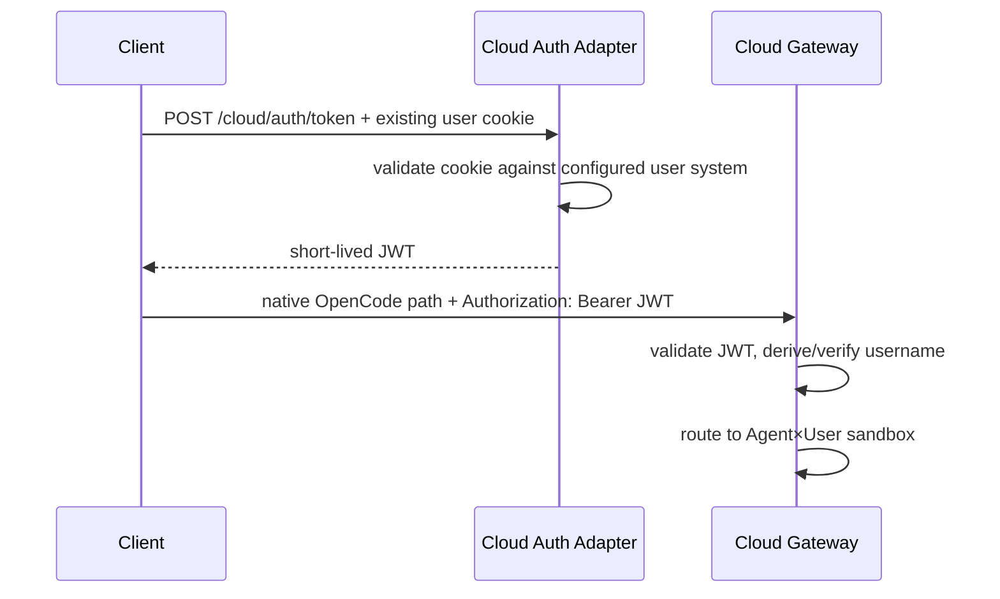

# OpenCode 云端智能体平台 — API 与路由契约

> 目标：保留 OpenCode 原生端点路径，同时只添加 Agent×User 沙箱所需的最小云端路由契约。  
> 不修改 OpenCode 源代码。  
> 初始阶段禁用身份认证，但预留 JWT 请求头契约。

---

## 1. API 设计原则

1. **不得重命名 OpenCode 原生路径。**
2. **不得用云端响应信封包装 OpenCode 响应。**
3. **不得更改 SSE 事件载荷。**
4. 云端路由元数据由网关读取，并在转发前移除。
5. 执行 `POST /session` 后，会话 ID 会持久化到网关注册表中，使后续原生会话路径能够解析到正确的沙箱。
6. GET/DELETE/SSE 请求不得依赖 HTTP 请求体。
7. 二进制上传/下载等云端专属能力使用独立的 `/cloud/*` 命名空间，不伪装成 OpenCode 原生端点。
8. 固定版本的 OpenCode `/doc` 规范是构建时兼容性契约。

当前部署的 Agent 定义及全局配置目录只读；原生全局配置写接口不能用于修改发布配置，失败响应仍按上游语义透传。用户的工作区文件和项目配置仍保留原生行为。创建项目或 HOME 的 `.opencode` 目录可能触发上游依赖准备，不属于空工作区初始化的无下载保证。

---

## 2. 为什么路由字段是 `_cloud`，而不是顶层 `agent`

OpenCode 已在一些原生请求体中使用 `agent` 字段，例如消息请求体可以包含 OpenCode 智能体选择。

因此，本平台**不得**复用顶层 `agent` 来表示云端 Agent 身份。

使用一个保留对象：

```json
{
  "_cloud": {
    "agent_id": "agent-code",
    "username": "alice"
  }
}
```

网关只对 `POST`、`PUT`、`PATCH` 且 `Content-Type: application/json`、正文为 JSON 对象的请求识别 `_cloud`，并在转发至 OpenCode 前移除它。其他方法、媒体类型和非对象 JSON 正文不解析或改写。原生 `agent`、`model`、`providerID`、`modelID` 等字段始终保留，不由云端路由层覆盖。

这样可以避免与以下原生字段冲突：

```json
{
  "agent": "build"
}
```

---

## 3. 路由元数据契约

### 3.1 带请求体的 JSON 请求

对于开始新路由上下文的 `POST`、`PATCH` 或 `PUT` JSON 请求，要求包含：

```json
{
  "_cloud": {
    "agent_id": "agent-code",
    "username": "alice"
  },
  "...native OpenCode fields...": "..."
}
```

最少字段：

| 字段 | 类型 | 是否必需 | 含义 |
|---|---|---:|---|
| `_cloud.agent_id` | string | 无法推断路由时必需 | 逻辑 Agent 模板 |
| `_cloud.username` | string | 无法推断路由时必需 | 用户沙箱所有者 |
| `_cloud.session_workspace` | string | 可选 | 当前用户工作区下的组织性工作区名称 |
| `_cloud.request_id` | string | 可选 | 调用方跟踪 ID；缺省时由网关生成 |

### 3.2 GET / DELETE / HEAD / SSE 请求

使用请求头，因为这些方法的请求体在不同客户端/代理之间并不可靠：

```text
X-Cloud-Agent-ID: agent-code
X-Cloud-Username: alice
X-Cloud-Request-ID: optional-client-id
```

### 3.3 为未来预留的 JWT 请求头

```text
Authorization: Bearer <jwt>
```

MVP：

```ini
[auth]
enabled = false
```

网关接受该请求头，但不要求必须提供。

未来模式（尚未实现）：

```ini
[auth]
enabled = true
```

当前若配置 `auth.enabled=true`，控制器会拒绝启动。未来实现后，相同的端点路径保持不变；只有该请求头变为必需。

---

## 4. 路由解析算法

对于包含原生 OpenCode 会话 ID 的请求路径，例如：

```text
/session/ses_abc/message
```

网关按以下顺序解析路由：

```text
1. Parse session_id from native path if present.
2. Lookup session_id in SQLite.
3. If found -> resolve sandbox directly.
4. If caller also supplied _cloud/headers -> require metadata to match stored mapping.
5. If session mapping is absent -> require explicit cloud routing metadata.
6. Resolve sandbox key = (agent_id, username).
7. Acquire/reuse sandbox.
8. Forward same method + same native path + native query/body after stripping _cloud.
```

不匹配示例：

```text
session_id belongs to (agent-code, alice)
request says (agent-code, bob)
```

返回云端路由冲突/错误，且绝不转发该请求。

即使禁用了身份认证，这项检查也能防止意外的跨路由。

---

## 5. OpenCode 原生端点

网关应充当固定版本 OpenCode 服务器规范的透明全路径代理，而不是仅维护少数路由的手写允许列表。

当前固定版本的兼容性测试至少必须覆盖以下原生路径：

### 全局

```text
GET /global/health
GET /global/event              # SSE
```

### 项目/路径/配置/提供商

```text
GET  /project
GET  /project/current
GET  /path
GET  /vcs
GET  /config
PATCH /config
GET  /config/providers
GET  /provider
GET  /provider/auth
```

### 会话

```text
GET    /session
POST   /session
GET    /session/status
GET    /session/:id
PATCH  /session/:id
DELETE /session/:id
GET    /session/:id/children
GET    /session/:id/todo
POST   /session/:id/init
POST   /session/:id/fork
POST   /session/:id/abort
POST   /session/:id/share
DELETE /session/:id/share
GET    /session/:id/diff
POST   /session/:id/summarize
POST   /session/:id/revert
POST   /session/:id/unrevert
POST   /session/:id/permissions/:permissionID
```

### 消息/命令/shell

```text
GET  /session/:id/message
POST /session/:id/message
GET  /session/:id/message/:messageID
POST /session/:id/prompt_async
POST /session/:id/command
POST /session/:id/shell
GET  /command
```

### 文件/工具/MCP/智能体

```text
GET  /find
GET  /find/file
GET  /find/symbol
GET  /file
GET  /file/content
GET  /file/status
GET  /experimental/tool/ids
GET  /experimental/tool
GET  /lsp
GET  /formatter
GET  /mcp
POST /mcp
GET  /agent
POST /log
GET  /event                      # SSE
GET  /doc
```

确切的路由集合取自构建/测试时固定镜像的 OpenCode `/doc`。如果上游新增路由，通用代理通常无需修改应用代码即可正常工作。

固定版本还包含带 `/api` 前缀的 v2 会话接口。网关在成功转发 `POST /api/session` 后，从响应对象的 `data.id` 读取原生会话 ID，并将其注册到同一 Agent×User 路由；缺少有效 `data.id` 时不得登记虚假路由。`GET /api/event` 与 `GET /api/session/:id/event` 都按 SSE 原样流式转发，其中 session event 先按持久化会话路由校验归属。当前源码和冻结 runtime 的实测已通过，证据为 `artifacts/sse/v2-report.json`；细粒度 SSE 取消检查采用当前源码和真实冻结运行时；生产镜像的安装/重启/模型突发验证单独记录在发布验收报告中。

OpenCode 规范中的 PTY WebSocket 当前未由云网关实现或代理，客户端不得将其视为已支持能力。

---

## 6. 原生会话创建示例

外部请求：

```http
POST /session
Content-Type: application/json
```

```json
{
  "_cloud": {
    "agent_id": "agent-code",
    "username": "alice"
  },
  "title": "repo investigation"
}
```

网关将请求转发至已获取的 Alice/agent-code 沙箱：

```http
POST /session
Content-Type: application/json
```

```json
{
  "title": "repo investigation"
}
```

OpenCode 响应原样返回。

网关副作用：

```text
session_id -> sandbox_id -> (agent-code, alice)
```

该映射将持久化到 SQLite。

---

## 7. 原生消息示例

外部请求：

```http
POST /session/ses_123/message
Content-Type: application/json
```

```json
{
  "_cloud": {
    "agent_id": "agent-code",
    "username": "alice"
  },
  "model": {
    "providerID": "cloud-model-gateway",
    "modelID": "coding-fast"
  },
  "agent": "build",
  "parts": [
    {
      "type": "text",
      "text": "Inspect the uploaded project and summarize the architecture."
    }
  ]
}
```

网关转发：

```json
{
  "model": {
    "providerID": "cloud-model-gateway",
    "modelID": "coding-fast"
  },
  "agent": "build",
  "parts": [
    {
      "type": "text",
      "text": "Inspect the uploaded project and summarize the architecture."
    }
  ]
}
```

请注意，原生 `agent` 保持不变，而 `_cloud` 会被移除。

---

## 8. SSE 路由

### 8.1 `/event`

请求：

```http
GET /event
Accept: text/event-stream
X-Cloud-Agent-ID: agent-code
X-Cloud-Username: alice
```

网关行为：

```text
resolve (agent-code, alice)
-> acquire/reuse sandbox
-> GET http://127.0.0.1:<sandbox_port>/event
-> stream bytes immediately
```

不得：

- 将数据流全部收集到内存中；
- 对每个事件进行 JSON 解码并重新编码，跟踪功能有此要求时除外；
- 更改事件名称；
- 向原生数据流中插入心跳。

如果需要平台级保活，应在传输/代理层处理，并测试客户端兼容性。

### 8.2 `/global/event`

使用相同的透明流式传输行为。

### 8.3 v2 事件流与取消

`GET /api/event` 与 `GET /api/session/:id/event` 同样直接流式转发。空闲的 session event 可能持续等待事件而尚未返回响应头，这不是网关缓冲；客户端在等待响应头期间断开时，网关也必须取消上游请求并释放沙箱 lease。

在固定版本的实测中，v2 `resume=false` 的持久 prompt 会触发相应事件。legacy `PATCH /session/:id` 不保证产生 v2 durable 事件，客户端不得以该操作作为事件流活性测试或业务保证。

---

## 9. 会话列表及其他不指定会话的 GET 路由

示例：

```http
GET /session
X-Cloud-Agent-ID: agent-code
X-Cloud-Username: alice
```

该请求被路由到 Alice 的 `agent-code` 沙箱，只返回该沙箱内可见的 OpenCode 会话。

这是 `Agent×User = sandbox` 带来的有益结果：平台端无需过滤 Bob 的 OpenCode 会话。

---

## 10. `/doc` 行为

公共网关已公开：

```text
GET /doc
```

无需仅为读取文档而创建沙箱。

当前实现：

1. `docs/upstream/opencode-1.18.29-openapi.json` 保存固定版本的 OpenAPI 3.1 规范。
2. 控制器启动时仅从该本地文件加载并缓存文档；缺失或损坏会明确导致启动失败，不联网获取。
3. 输出保留全部原生路径、响应和组件 schema，并为 HTTP operation 增加可选云路由请求头参数。
4. 顶层 `x-cloud-routing` 记录 `_cloud`/header 路由、会话查表、legacy HTTP 兼容范围，以及 PTY WebSocket 尚不支持。
5. `GET /doc` 直接返回缓存 JSON，不依赖 Registry、Docker backend 或沙箱 acquire。

这样可防止文档请求触发沙箱生命周期操作。

上游 OpenCode 原始规范也存储在发布包中，用于差异测试。

---

## 11. 云端专属文件 API

OpenCode 已提供文件列表/内容 API，但云平台还需要在持久化用户工作区内提供可靠的二进制上传/下载功能。

这些是附加端点，不会改变 OpenCode 原生路径。

文件 API 的可选 `session_id` 只是当前 Agent×User 工作区下的目录分组名，用于选择 `sessions/{session_id}`；它不查询会话路由表，也不证明该 ID 已由 OpenCode 创建。安全边界仍由 `agent_id`、`username`、路径规范化和 bind 根目录共同提供。

### 11.1 上传

```text
POST /cloud/files/upload
Content-Type: multipart/form-data
```

字段：

| 字段 | 是否必需 | 示例 |
|---|---:|---|
| `agent_id` | 是 | `agent-code` |
| `username` | 是 | `alice` |
| `session_id` | 可选 | `ses_123` |
| `relative_path` | 可选 | `inputs/report.xlsx` |
| `file` | 是 | 二进制 multipart 文件 |

存储规则：

如果提供 `session_id`：

```text
host:
/srv/cloud-agent/workspaces/{agent_id}/{username}/sessions/{session_id}/{relative_path}

container:
/workspace/sessions/{session_id}/{relative_path}
```

如果省略 `session_id`：

```text
/workspace/shared/{relative_path}
```

响应：

```json
{
  "ok": true,
  "path": "/workspace/sessions/ses_123/inputs/report.xlsx",
  "size": 123456,
  "sha256": "..."
}
```

### 11.2 下载

```text
GET /cloud/files/download?agent_id=agent-code&username=alice&session_id=ses_123&path=outputs/result.xlsx
```

响应：

```text
application/octet-stream
Content-Disposition: attachment; filename="result.xlsx"
```

使用流式文件响应，不要将整个文件加载到内存中。

### 11.3 列出云端工作区文件

建议的小型扩展：

```text
GET /cloud/files/list?agent_id=agent-code&username=alice&session_id=ses_123&path=outputs
```

只返回元数据：

```json
{
  "entries": [
    {
      "name": "result.xlsx",
      "type": "file",
      "size": 123456,
      "mtime": "2026-09-06T12:00:00Z"
    }
  ]
}
```

### 11.4 文件路径验证

每项云端文件操作都必须：

1. 将调用方路径视为相对路径；
2. 拒绝绝对路径；
3. 对最终路径进行规范化；
4. 要求规范化路径仍位于解析出的 Agent×User 工作区根目录下；
5. 拒绝路径遍历；
6. 在打开/创建文件时拒绝符号链接逃逸；
7. 执行已配置的上传大小和工作区大小限制；
8. 将上传内容写入临时文件，并在完成后以原子方式重命名；
9. 在切实可行时，在流式传输过程中计算 SHA-256。

云端文件 API 是一个便利接口。它们不会改变容器的实际安全边界。

---

## 12. 服务端会话目录绑定（0.2.1）

容器仍按 Agent×User 复用，`opencode serve` 的进程启动目录为：

```text
/workspace
```

文件仍可组织在以下目录下：

```text
/workspace/shared
/workspace/sessions/ses_123
/workspace/sessions/ses_456
```

`POST /session`（包括兼容的 `/api/session`）先取得原生 ID、保存路由并创建对应目录，再调用固定 OpenCode 1.18.29 的 `/experimental/control-plane/move-session`，以 `moveChanges=false` 绑定 `/workspace/sessions/<id>`。读回确认原生 `directory` 一致后才返回初始化成功。无需模型提示词或可选 Hook。

旧会话在下一次执行前按需绑定，保留 ID 和历史。绑定失败返回 409/502，禁止回退到根目录执行；已经保存的路由可在重试时恢复。绑定不移动旧工作区中的文件，也不会中断忙碌会话。注册表中的历史 `session_workspace` 仅保留为兼容元数据，实际文件与执行目录统一使用 `sessions/<id>`。

`GET /session` 汇总该 Agent×User 沙箱跨目录会话；`GET /event` 内部订阅 `/global/event` 并解开目录信封，外部仍收到原生 `type/properties` SSE。状态、权限和问题列表按会话目录汇总，发布排空与空闲回收使用同样的状态汇总。权限/问题回复可携带 `X-Cloud-Session-ID`，由服务端查表路由；与 URL 或 Agent/User 冲突时拒绝请求。此平台头不会转发给沙箱。

这里保证默认执行目录一致性，不是同一用户各会话之间的文件系统安全隔离；显式绝对路径仍可访问该用户沙箱中其他允许的位置。原生移动目录接口不能由客户端直接调用，目录绑定由平台管理。

---

## 13. 模型选择契约

不要在云端网关中另行设计第二个模型字段。

使用 OpenCode 原生的 `model` 字段：

```json
{
  "model": {
    "providerID": "cloud-model-gateway",
    "modelID": "coding-fast"
  }
}
```

在沙箱内部，OpenCode 提供商配置将 `cloud-model-gateway` 指向 LiteLLM。

本机地址为 `http://host.docker.internal:4001/v1`；宿主控制器使用 `http://127.0.0.1:4001/v1`。LiteLLM 内部端口为 4000，宿主发布端口为 4001，并同时绑定 loopback 与自动探测的 Docker bridge 地址。进程存活检查使用 `/health/liveliness`，指标抓取允许 `/metrics` 重定向到 `/metrics/`。

即使物理部署发生变化，逻辑模型名称仍保持稳定。

示例：

```text
coding-fast
  -> provider A endpoint 1
  -> provider A endpoint 2

coding-quality
  -> provider B endpoint 1
  -> provider B endpoint 2
```

负载均衡在逻辑模型名称背后进行。

---

## 14. 网关错误契约

当错误由上游沙箱产生时，应原样透传 OpenCode 原生错误。

云端特有错误应能被明确区分。

当前实现的云端 HTTP 错误使用 FastAPI 的 `detail` 字段及相应 HTTP 状态码；请求关联 ID 从响应头 `X-Cloud-Request-ID` 获取。下述结构及错误码属于后续统一错误封装的建议，客户端目前不得依赖它们已经实现。

建议的 JSON：

```json
{
  "error": {
    "type": "cloud_route_error",
    "code": "SANDBOX_START_TIMEOUT",
    "message": "Sandbox did not become healthy before the configured deadline.",
    "request_id": "req_..."
  }
}
```

建议的云端错误码：

```text
ROUTING_METADATA_REQUIRED
ROUTING_METADATA_MISMATCH
AGENT_NOT_FOUND
SANDBOX_START_FAILED
SANDBOX_START_TIMEOUT
SANDBOX_UNHEALTHY
SESSION_ROUTE_NOT_FOUND
UPLOAD_TOO_LARGE
WORKSPACE_QUOTA_EXCEEDED
INVALID_WORKSPACE_PATH
MODEL_GATEWAY_UNHEALTHY
AUTH_REQUIRED              # future
AUTH_INVALID               # future
```

除非故障发生在云端层，否则不得将上游 OpenCode `4xx/5xx` 重写为云端错误。

---

## 15. 请求关联

对于每个请求：

1. 接受可选的 `X-Cloud-Request-ID` 或 `_cloud.request_id`；
2. 否则生成一个；
3. 将其记录在网关日志中；
4. 向沙箱转发关联请求头；
5. 在支持的情况下，将其包含在模型网关的元数据/请求头中；
6. 通过响应头 `X-Cloud-Request-ID` 返回最终 ID，包括云端 HTTP 错误响应。

ID 限制为 1–128 个 ASCII 字母、数字、下划线、点、冒号或连字符；不符合规则的值替换为新生成的安全 ID。控制器通过原生 sessionID/messageID 关联沙箱日志，本地插件将相同标识传给 LiteLLM 日志回调。LiteLLM 的追踪 ID 对应原生用户消息 ID，一条用户消息可能触发多个物理模型调用，不能据此假设一对一关系。同步消息响应可补充 parentID；异步调用若需要精确到消息的关联，应提供原生可选 messageID。

平台结构化日志仅输出允许的元数据字段，不记录请求正文、上传内容、Authorization 或提供商密钥。用户名记录为哈希，容器 ID 记录为前缀。真实关联和敏感字段检查见 `artifacts/logging/report.json`。

不要将请求 ID 或会话 ID 放入高基数 Prometheus 标签。

---

## 16. 身份认证扩展契约

MVP：

```text
No auth enforcement.
```

预留端点：

```text
POST /cloud/auth/token
```

当前 `auth.enabled=true` 不受支持并会使控制器拒绝启动。认证关闭时，`token_endpoint_enabled=true` 使该端点返回 `501` 和 `AUTH_DISABLED`；设为 `false` 时端点未注册并返回 404。以下流程尚未实现。

未来流程：



启用身份认证后，JWT 身份必须成为 `username` 的权威来源；调用方提供的 `_cloud.username` 必须与之匹配。

---

## 17. 云端层添加的健康与可观测性端点

建议：

```text
GET /cloud/health
GET /cloud/health/ready
GET /metrics
```

`/cloud/health` 仅检查控制器进程是否存活。

`/cloud/health/ready` 检查：

- SQLite 可写；
- Docker 守护进程可访问；
- 在配置为必需时，模型网关可访问；
- 基础 Agent 镜像存在；
- 工作区根目录可写。

它不得仅为响应就绪状态而创建 Agent 沙箱。

---

## 18. 针对 OpenCode 的兼容性测试

每当 `OPENCODE_VERSION` 发生变化时：

1. 构建候选镜像；
2. 启动一个沙箱；
3. 验证 `GET /global/health` 返回健康状态和完全符合预期的版本；
4. 下载 `/doc`；
5. 将原生路径和模式与上一份固定规范进行差异比较；
6. 对会话/消息/事件/文件/MCP 端点运行黄金契约调用；
7. 验证网关会移除 `_cloud`，且上游绝不会看到它；
8. 验证 SSE 保持流式传输；
9. 只有完成上述步骤，才更新发布版本固定值。

OpenCode 新增的路由通常应该只需刷新规范，因为网关是通用代理。

---

## 19. 本 API 契约所依据的当前 OpenCode 事实

已于 2026-09-06 根据上游文档验证：

- `opencode serve` 在 `/doc` 发布 OpenAPI 3.1 规范。
- 当前服务器文档列出了 `/global/health`、`/global/event`、会话/消息/文件/MCP/提供商/智能体路由及 `/event` SSE。
- `POST /session/:id/message` 的原生字段包括 `model`、`agent`、`parts` 等，因此云端路由元数据不得复用原生 `agent`。
- `/event` 是服务器发送事件流。
- OpenCode 自定义提供商支持配置 `baseURL`，从而可通过模型网关路由模型流量。

参考资料：

- https://opencode.ai/docs/server/
- https://opencode.ai/docs/providers/

## 0.2.0：本地 Web 与平台管理 API

以下契约扩展前文。0.2.0 安装器生成 `<data_root>/admin-token`（权限 0600），启用单管理员 Bearer 认证；这与旧配置中未实现的 JWT `auth.enabled` 是两回事。旧数据、路由元数据和原生 SSE 协议保持兼容，但旧客户端须增加 `Authorization: Bearer <token>`。转发至 OpenCode 前移除该凭据。

`GET /cloud/health` 提供匿名最小存活结果；回环地址的 `/metrics` 供原有 Prometheus 抓取。其他聊天、文件、SSE、管理与 OpenAPI 接口均需要认证。`GET /cloud/capabilities` 返回 `version=0.2.0`、`authentication=bearer`、`management=true`、资源种类及上传上限。

通用写入支持 `revision` 乐观锁（从 catalog 读取），过期返回 409。请求 DTO 在 `/openapi.json` 中公布，非法请求 422，业务校验 400/403/409，未知 ID 404。保存草稿返回 `{"ok":true}`，异步发布返回 `{"job_id":"job_…"}`；必须轮询任务确认成功，不以 HTTP 200 等同于生效。

| 方法与端点 | 请求/响应要点 |
|---|---|
| GET `/cloud/agents` | 平台 Agent 生效配置、版本、模型分配与扩展版本引用；含停用项以支持历史 |
| GET `/cloud/models?agent_id=…` | 已发布且启用模型；指定 Agent 后过滤已分配模型；密钥遮罩 |
| GET `/cloud/admin/catalog` | `revision`、models/resources/agents/jobs 字典、gateway_versions/gateway_active；秘密字段遮罩 |
| GET `/cloud/admin/models` | 模型草稿及 `references` Agent ID 列表 |
| PUT `/cloud/admin/models/{id}` | `{"model":ModelDefinition,"revision":N}` |
| POST `/cloud/admin/models/import` | `{"models":[ModelDefinition],"replace":false,"revision":N}`，原子导入，不分配 Agent |
| DELETE `/cloud/admin/models/{id}?revision=N` | 先替换全部草稿及生效引用；删除后须发布网关 |
| POST `/cloud/admin/models/{id}/test` | 测试已经发布的模型，经 LiteLLM 发出一个短模型请求；返回分类错误，不回显上游密钥 |
| POST `/cloud/admin/models/apply` | `{"revision":N}` 发布模型草稿；或 `{"version":N}` 恢复历史网关版本；返回任务 |
| GET `/cloud/admin/agents` | Agent 草稿、生效版本与历史 |
| PUT `/cloud/admin/agents/{id}` | `{"config":AgentDefinition,"revision":N}`，新 ID 创建，已有 ID 更新草稿 |
| POST `/cloud/admin/agents/{id}/copy` | `{"id":"new-agent","revision":N}`；保留全局版本引用、复制已绑定私有资源 |
| PUT `/cloud/admin/agents/{id}/bindings` | 可选 allowed_model_ids/default_model_id/small_model_id/bindings/revision |
| GET `/cloud/admin/agents/{id}/effective-config` | 草稿、当前生效版本、资源来源/版本/文件/脱敏配置；发布仍需运行校验 |
| POST `/cloud/admin/agents/{id}/apply` | `{"revision":N}`，编译、隔离加载、排空、更新目标 Agent |
| POST `/cloud/admin/agents/{id}/rollback` | `{"version":N}`，用历史配置发布新版本，保留会话和工作区 |
| GET `/cloud/admin/resources` | 全局和各 Agent 私有资源目录 |
| PUT `/cloud/admin/resources/{id}` | `{"resource":{"kind":"mcp|hook|skill","name":"name","owner":null,"data":{},"archived":false},"revision":N}`；新 Skill 须上传 |
| POST `/cloud/admin/resources/{id}/copy` | `{"id":"new-resource","owner":"agent-code","revision":N}` 复制为私有资源 |
| POST `/cloud/admin/resources/{id}/upload` | multipart：file、owner（全局传空）、revision；只用于 Skill |
| GET `/cloud/admin/resources/{id}/versions` | draft、不可变 versions、references |
| GET `/cloud/admin/resources/{id}/file?path=SKILL.md&version=N` | 只接受资源文件树中的相对路径；省略版本读取草稿；附件响应 |
| POST `/cloud/admin/resources/{id}/publish` | `{"agent_id":"agent-code"}`；私有项默认 owner；Hook 静态编译并隔离加载，返回 version |
| POST `/cloud/admin/resources/{id}/test` | `{"agent_id":"agent-code"}`；隔离沙箱验证，MCP 返回连接状态及工具 ID |
| GET `/cloud/admin/jobs/{id}` | queued/validating/waiting/applying/succeeded/failed；result.version、脱敏 error |

`ModelDefinition` 包括 id、name、provider（openai-compatible/openai/anthropic/google）、upstream_model、base_url、api_key、headers、parameters、context/output、enabled。旧模型的 `legacy=true` 保留部署环境变量；导入不得声明 legacy。参数支持 temperature、top_p、max_tokens、max_completion_tokens、presence_penalty、frequency_penalty、seed、reasoning_effort。不支持字段返回错误，不静默丢弃。

`AgentDefinition` 包括 name、description、enabled、instructions、allowed_model_ids、default_model_id、small_model_id、bindings。bindings 为有序 `[{"id":"resource-id","version":1}]`，Hook 顺序取该数组中的相对顺序。默认/小模型必须属于 allowed_model_ids；全局版本固定，私有资源只允许 owner 引用。API 不接受镜像、宿主机挂载与任意 Docker 参数。

MCP data 示例：远程 `{"type":"remote","url":"https://mcp.example/api","headers":{},"timeout":10000,"enabled":true,"oauth":false}`；命令 `{"type":"local","command":["python3","/opt/agent/skills/my-skill/server.py"],"cwd":"/workspace","environment":{},"timeout":10000,"enabled":true}`。cwd 由沙箱子进程处理，生成给 OpenCode 的配置仅使用原生字段；不自动安装依赖。

Hook data：`{"entry":"hook.ts","sources":{"hook.ts":"export default async () => ({});"}}`。发布版本保存静态编译产物，草稿保留源码；不在控制器执行 JS/TS。Skills 上传校验路径、链接、重复目标、根目录和元数据，限制 20 MiB/100 MiB/1000 文件，不执行文件。全局发布不改变任何 Agent，归档保留历史引用。

发布期阻止受影响 Agent 的新请求，保留停止生成和权限/问题回复入口，以真实 `/session/status` 和请求计数判断任务结束。等待 120 秒超时保留草稿与旧生效版本。中断任务在控制器重启时恢复旧网关配置并标记失败；历史版本不可变。

curl 示例（Ubuntu；管理员凭据只放在变量中）：

```bash
API=http://127.0.0.1:18080
TOKEN=$(sudo cat /srv/cloud-agent/data/admin-token)
curl -fsS -H "Authorization: Bearer $TOKEN" "$API/cloud/capabilities"
curl -fsS -H "Authorization: Bearer $TOKEN" "$API/cloud/admin/catalog"
curl -fsS -H "Authorization: Bearer $TOKEN" -H 'Content-Type: application/json' \
  -X PUT "$API/cloud/admin/resources/docs-mcp" \
  -d '{"resource":{"kind":"mcp","name":"docs","owner":null,"data":{"type":"remote","url":"https://mcp.example/api","oauth":false}}}'
curl -fsS -H "Authorization: Bearer $TOKEN" -F 'file=@SKILL.md' \
  "$API/cloud/admin/resources/my-skill/upload"
curl -fsS -H "Authorization: Bearer $TOKEN" -H 'Content-Type: application/json' \
  -d '{"agent_id":"agent-code"}' "$API/cloud/admin/resources/my-skill/publish"
curl -fsS -H "Authorization: Bearer $TOKEN" -H 'Content-Type: application/json' \
  -X PUT -d '{"bindings":[{"id":"my-skill","version":1}]}' \
  "$API/cloud/admin/agents/agent-code/bindings"
curl -fsS -H "Authorization: Bearer $TOKEN" -H 'Content-Type: application/json' \
  -d '{}' "$API/cloud/admin/agents/agent-code/apply"
# 将返回的 job_id 填到下一条；bindings 是完整替换列表。
curl -fsS -H "Authorization: Bearer $TOKEN" "$API/cloud/admin/jobs/job_REPLACE"
unset TOKEN
```

本机服务默认 `127.0.0.1:18765`，`GET /local/bootstrap` 获取 CSRF token；本地变更请求携带 `X-Local-CSRF`。`PUT /local/connection` 接受 url/token/remember；`POST /local/connection/test` 查询远端就绪和能力。`POST /local/opencode/discover` 接受可选 directory/file；preview 接受 source_id；import 接受 preview_id/selected/replace/revision。预览秘密数据在本地内存暂存 15 分钟，浏览器只获遮罩；`/remote/*` 以服务端保存的 Bearer 凭据流式转发远端 API。Host/Origin/Fetch-Site 校验限制同源，管理凭据只通过 Windows Credential Manager 持久化。

## 0.2.2：管理配置 JSON 预览

以下接口均要求管理员 Bearer 认证；只读预览不保存草稿、不创建运行目录、不执行插件或触发发布。

| 方法与路径 | 返回内容 |
|---|---|
| `GET /cloud/admin/config-preview` | 全局模型、全局资源库、当前网关配置 `active_gateway`、`gateway_version` 与 `gateway_applying` |
| `GET /cloud/admin/agents/{agent_id}/effective-config` | 保留原有字段，新增已发布文件内容 `active_opencode` 和服务端编译的草稿 `draft_opencode` |
| `POST /cloud/admin/agents/{agent_id}/config-preview` | 将请求中的完整 `config` 按实际发布编译规则验证，返回 `opencode` 与 `sources`；不要求先保存 Agent |

POST 使用与 Agent 保存接口相同的 `AgentWrite` DTO。模型、资源版本和归属校验失败时返回错误，不生成看似有效的 JSON。`active_opencode` 在尚未发布或没有对应文件时为 `null`。

全局配置是资源库与 LiteLLM 网关配置，不是一份自动加载到全部 Agent 的 OpenCode 文件，因此全局返回 `scope: "resource-library"`、`opencode: null`。实际 `opencode.json` 在 Agent 选择模型和资源后生成。密钥、headers、environment 和网关 extra_headers 脱敏；全局预览不返回 Hook 源码。

表单旁的 MCP、Skill、Hook JSON 显示对应原生配置片段；模型表单同时显示网关条目及 Agent 模型声明片段。Agent 完整配置预览由服务端生成，保存与发布仍需分别操作。

```bash
API=http://127.0.0.1:18080
TOKEN=$(sudo cat /srv/cloud-agent/data/admin-token)
curl -fsS -H "Authorization: Bearer $TOKEN" "$API/cloud/admin/config-preview"
curl -fsS -H "Authorization: Bearer $TOKEN" "$API/cloud/admin/agents/agent-code/effective-config"
# agent-preview.json 内容为 {"config": {...完整 AgentDefinition...}}
curl -fsS -H "Authorization: Bearer $TOKEN" -H 'Content-Type: application/json' \
  --data-binary @agent-preview.json "$API/cloud/admin/agents/agent-code/config-preview"
unset TOKEN
```
